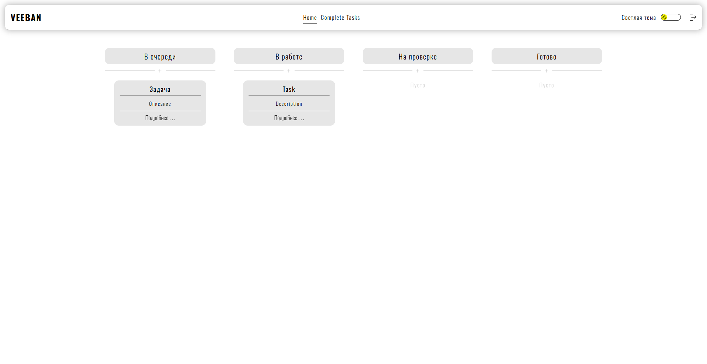
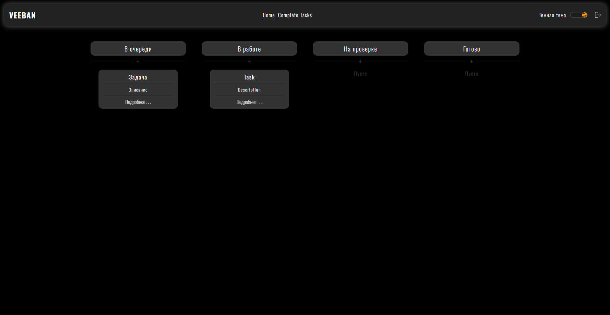

# 🛹 Vue Kanban Board

[](https://vuejs.org/)
[](https://pinia.vuejs.org/)
[](https://router.vuejs.org/)
[](https://supabase.com/)
[](https://www.typescriptlang.org/)
[](https://vitejs.dev/)

### https://hutt4.github.io/vue-kanban

Интерактивный канбан-борд с поддержкой темной/светлой темы и бэкендом на Supabase. Полноценное SPA-приложение с авторизацией, drag-and-drop и плавными анимациями.

| Светлая тема                                              | Темная тема                                             |
| --------------------------------------------------------- | ------------------------------------------------------- |
|  |  |

## 🌟 Ключевые возможности

### Основной функционал

- 🖱️ Drag-and-drop карточек между колонками
- ✏️ Редактирование задач
- 💬 Система комментариев к задачам
- 🚦 Маршрутизация между разделами (Vue Router)

### Персонализация

- 🌓 Светлая/темная тема
- ✨ Плавные анимации интерфейса
- 📅 Форматирование дат (Day.js)

### Безопасность

- 🔐 Авторизация через Supabase
- 🔒 Настроенные политики RLS
- 🛡️ Защищенные роуты

## 🛠 Технологический стек

### Frontend

- [Vue 3](https://vuejs.org/) - Фреймворк
- [Pinia](https://pinia.vuejs.org/) - Управление состоянием
- [Vue Router](https://router.vuejs.org/) - Навигация
- [TypeScript](https://www.typescriptlang.org/) - Типизация

### Backend/Utilities

- [Supabase](https://supabase.com/) - Бэкенд (Auth, Database)
- [Day.js](https://day.js.org/) - Форматирование дат
- [UUID](https://www.npmjs.com/package/uuid) - Уникальные идентификаторы
- [Vite](https://vitejs.dev/) - Сборка проекта

## 🚀 Быстрый старт

```bash
git clone https://github.com/huTT4/vue-kanban.git

cd vue-kanban

npm install

npm run dev
```
