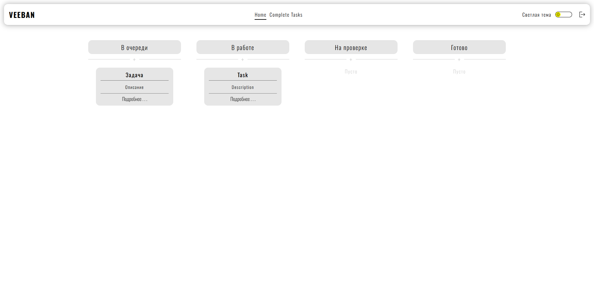
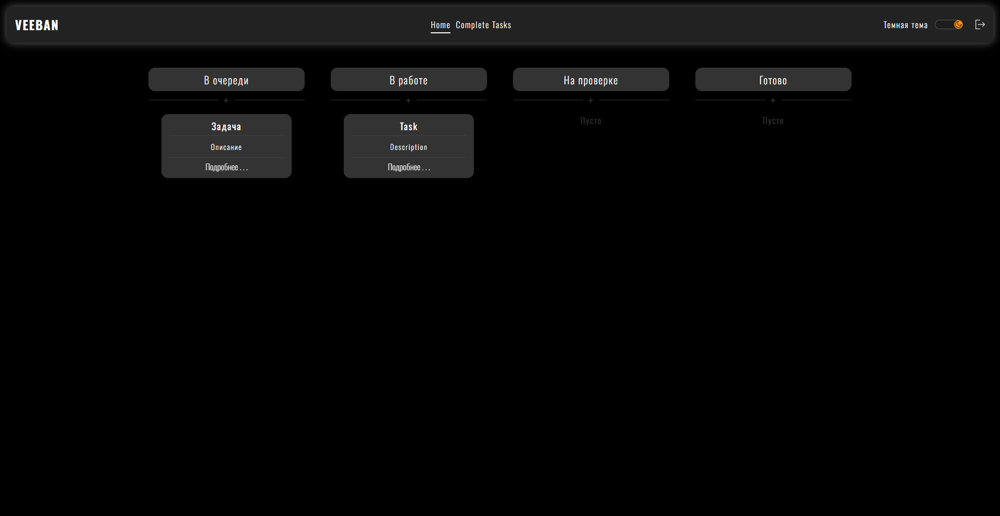

# 🛹 Vue Kanban Board

[](https://vuejs.org/)
[](https://supabase.com/)
[](https://www.typescriptlang.org/)
[](https://vitejs.dev/)

Интерактивный канбан-борд с поддержкой темной/светлой темы и бэкендом на Supabase. Полноценное SPA-приложение с авторизацией, drag-and-drop и плавными анимациями.

| Светлая тема                                              | Темная тема                                             |
| --------------------------------------------------------- | ------------------------------------------------------- |
|  |  |

## 🌟 Ключевые возможности

### Основной функционал

- 🖱️ Drag-and-drop карточек между колонками
- ✏️ Редактирование задач
- 💬 Система комментариев к задачам
- 🚦 Маршрутизация между разделами (Vue Router)

### Персонализация

- 🌓 Светлая/темная тема
- ✨ Плавные анимации интерфейса
- 📅 Умное форматирование дат (Day.js)

### Безопасность

- 🔐 Авторизация через Supabase
- 🔒 Настроенные политики RLS
- 🛡️ Защищенные роуты

## 🛠 Технологический стек

### Frontend

- **Vue 3**
- **Pinia**
- **Vue Router**
- **TypeScript**

### Backend

- **Supabase**

### Утилиты

- **Day.js** - Форматирование дат
- **UUID** - Уникальные идентификаторы
- **Vite** - Сборка проекта

## 🚀 Быстрый старт

```bash
git clone https://github.com/huTT4/vue-kanban.git

cd vue-kanban

npm install

npm run dev
```
